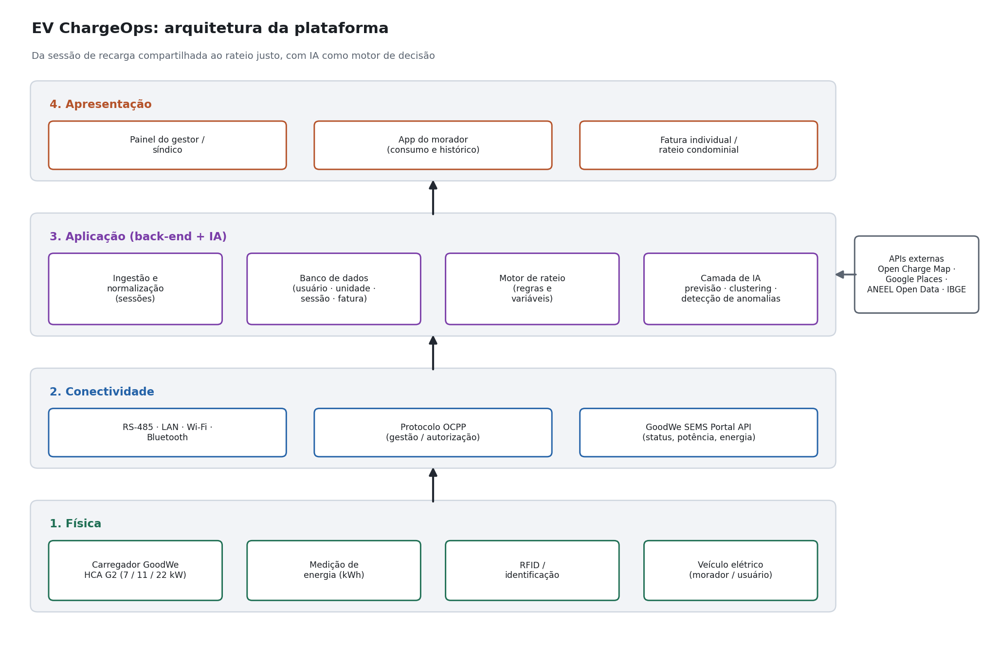

# EV ChargeOps

**Infraestrutura de recarga compartilhada transformada em dados estruturados, rateio justo e inteligência acionável.**

Enterprise Challenge 2026 · GoodWe + FIAP · Fase 4 "Energia para sobreviver" · Sprint 01 (Pesquisa e documentação)

Este repositório é o documento central da Sprint 01. Ele reúne a pesquisa das três frentes do desafio, a arquitetura proposta, o modelo de rateio, o papel da inteligência artificial e o plano para a Sprint 02. O código funcional não é objeto desta sprint; além do documento, o repositório traz apenas o diagrama de arquitetura e um conjunto de dados simulados que servirá de base para a implementação.

---

## Equipe

| Aluno | RM | Grupo |
|---|---|---|
| Paulo Roberto Faulstich Rego | 572292 | 27 |

Contato: paulo.faulstich@gmail.com

---

## 1. O desafio

A GoodWe é uma das maiores fabricantes globais de inversores e sistemas de armazenamento de energia, presente em mais de 100 países. No Brasil, mantém parceria com a FIAP por meio do Energy Innovation Lab, onde opera um carregador de veículos elétricos modelo HCA G2.

O crescimento acelerado da frota de veículos elétricos cria um problema operacional concreto: infraestruturas de recarga compartilhadas (garagens de condomínios, edifícios corporativos e campus universitários) não dispõem de mecanismos integrados para estruturar as sessões por usuário, calcular o consumo individual, aplicar regras de rateio justas e oferecer uma experiência digital clara para moradores e gestores.

Cada sessão de recarga produz dados úteis: duração, energia entregue (kWh), horário de uso, frequência, picos e intervalos de ociosidade. Quando esses dados ficam dispersos em registros soltos, eles não viram inteligência. O EV ChargeOps propõe exatamente essa transformação, usando IA como motor de decisão.

A pergunta que guia o projeto:

> Como transformar sessões de recarga de veículos elétricos em uma infraestrutura compartilhada com dados estruturados, rateio justo e inteligência acionável?

A Sprint 01 responde a essa pergunta com pesquisa e definição de arquitetura. A Sprint 02 implementará a solução sobre as decisões aqui documentadas.

---

## 2. Frente 1: Contexto e Problema

Opções de aprofundamento escolhidas: **Opção A (Análise de mercado)** como principal e **Opção C (Análise de dados públicos)** como complemento.

### 2.1 O que é infraestrutura de recarga compartilhada e seus desafios

Recarga compartilhada é a situação em que vários usuários dividem um número limitado de pontos de recarga e, muitas vezes, uma mesma alimentação elétrica. É o caso típico da garagem de um condomínio residencial, de um edifício corporativo ou de um campus.

Os principais desafios operacionais enfrentados por quem administra esses ambientes são:

- **Atribuição de consumo.** Sem identificação por usuário, não há como saber quem consumiu quanto, o que inviabiliza a cobrança individual e gera conflito entre moradores.
- **Limite de potência da instalação.** A entrada de energia do prédio não foi dimensionada para vários carros carregando ao mesmo tempo. Sem balanceamento de carga, o disjuntor geral pode desarmar ou o transformador ser sobrecarregado.
- **Rateio justo.** É preciso separar o que é consumo individual do que é custo comum (manutenção, perdas técnicas, conectividade) e dividir o custo comum de forma defensável em assembleia.
- **Gestão e transparência.** O síndico precisa de visibilidade (quem usa, quanto se consome, qual ponto falha) e o morador precisa de um histórico claro do que está pagando.
- **Conformidade regulatória.** A operação precisa respeitar as normas da ANEEL, as normas técnicas (ABNT) e, em São Paulo, a legislação municipal específica (detalhada na Frente 2).

### 2.2 Anatomia de uma sessão de recarga

Do ponto de vista técnico, uma sessão é o intervalo entre o momento em que o veículo é conectado e autorizado e o momento em que a recarga é encerrada. O ciclo, em um carregador como o GoodWe HCA G2, é aproximadamente este:

1. **Conexão e identificação.** O usuário conecta o plugue e se autentica (cartão RFID, aplicativo ou início automático). A autenticação é o que permite atribuir a sessão a uma pessoa.
2. **Autorização e início.** O carregador verifica disponibilidade de potência e inicia a entrega de energia, negociando a corrente com o veículo.
3. **Recarga.** Durante a sessão, o carregador mede potência instantânea (kW) e acumula energia entregue (kWh). É aqui que pode atuar o balanceamento de carga, reduzindo a potência quando a instalação está perto do limite.
4. **Encerramento.** A sessão termina quando a bateria atinge o alvo, quando o usuário desconecta ou por interrupção (queda de energia, falha, comando remoto).

Os dados gerados e que podem ser capturados: identificador do usuário/cartão, identificador do carregador, horário de início e fim, energia entregue (kWh), potência média e de pico, status de encerramento (concluída ou interrompida) e eventos da sessão (erros, quedas). Esses campos são exatamente os que estruturamos no esquema de dados da Seção 4.

### 2.3 Modelos de negócio para recarga compartilhada

Os modelos praticados no Brasil e no mundo:

- **Recarga gratuita / incluída no condomínio.** O custo entra na taxa condominial e é dividido por todos. Simples, mas injusto: quem não tem carro elétrico subsidia quem tem.
- **Cobrança por kWh.** Cada usuário paga pela energia que efetivamente consumiu. É o modelo mais justo e o que a NBR 17019:2022 e a legislação paulistana favorecem ao exigir medição individualizada.
- **Cobrança por tempo.** Paga-se pelo tempo de ocupação do ponto, e não pela energia. Útil para liberar vagas, mas penaliza carros que carregam devagar.
- **Assinatura mensal.** Valor fixo por usuário (cobrindo infraestrutura e suporte), geralmente somado ao reembolso da energia consumida.
- **Rateio condominial estruturado.** Combina medição individual por kWh com um rateio do custo comum (perdas, manutenção, software). É o modelo que o EV ChargeOps adota (Seção 5).

### 2.4 Opção A: Análise de mercado

Mapeamento de cinco soluções que resolvem problemas próximos ao do EV ChargeOps. Para cada uma, o problema que resolve, as funcionalidades principais, o modelo de negócio e as limitações conhecidas em relação ao nosso contexto (condomínio brasileiro).

| Solução | Problema que resolve | Funcionalidades principais | Modelo de negócio | Limitações para o nosso contexto |
|---|---|---|---|---|
| **Zaptec** (Noruega) | Recarga em estacionamentos compartilhados com instalação enxuta | Balanceamento de carga ativo entre vários pontos no mesmo circuito; suporte a OCPP | Venda de hardware + plataforma de gestão | Foco europeu; rateio e faturamento dependem de integradores locais |
| **Wallbox Pulsar Plus / Pulsar Pro** (Espanha) | Recarga residencial e em condomínios | Power sharing e balanceamento dinâmico (Power Boost); myWallbox Business para gerir usuários, ler sessões e definir tarifas; RFID | Hardware + licença de software para uso compartilhado | Faturamento e rateio condominial exigem licença empresarial; não modela rateio de custo comum no padrão brasileiro |
| **ChargePoint** (EUA) | Recarga em prédios multifamiliares e corporativos | Software em nuvem; cobra o morador diretamente e repassa 100% do custo de energia ao condomínio; power sharing; modos "assigned" e "community" | Taxa mensal de serviço por motorista + custo da energia | Forte nos EUA; modelo de tarifa e repasse não está adaptado às regras da ANEEL nem à bandeira tarifária brasileira |
| **NeoCharge** (Brasil) | Recarga e cobrança em condomínios brasileiros | Plataforma de gestão com monitoramento remoto, app, alertas de falha, relatório de consumo por veículo e cobrança por kWh | Hardware + assinatura da plataforma | Solução fechada de fornecedor; menos flexível para o condomínio definir suas próprias regras de rateio |
| **Copel (eletrovia / Eletroposto Fácil)** (Brasil) | Recarga pública rápida em rodovias e cidades do Paraná | Rede de eletropostos; app para disponibilidade, tempo estimado e pagamento | Operação de rede pública de recarga | Voltada a recarga pública de passagem, não a rateio em garagem compartilhada |

**Análise própria.** Os players internacionais (Zaptec, Wallbox, ChargePoint) já resolvem bem o balanceamento de carga e a medição por usuário, mas tratam o faturamento como repasse direto de energia, sem o conceito de rateio de custo comum que a vida em condomínio brasileiro exige (perdas técnicas, manutenção e software dividida em assembleia, com prestação de contas). Os players brasileiros se dividem entre soluções de condomínio fechadas de fornecedor (NeoCharge) e operação de recarga pública (Copel), que resolve outro problema. A lacuna que o EV ChargeOps ocupa é a de uma camada de inteligência e rateio aberta, que parte do carregador GoodWe já instalado, estrutura os dados da sessão e aplica regras de rateio que o próprio condomínio define e audita, com IA como motor de previsão e integridade.

### 2.5 Opção C: Dados públicos sobre a frota

Segundo a ABVE (Associação Brasileira do Veículo Elétrico), o mercado de eletrificados leves fechou 2025 com 223.912 unidades vendidas, recorde da série histórica e crescimento de 26% sobre 2024, cerca de dez vezes o ritmo do mercado total de leves (2,6%). De janeiro de 2012 a março de 2026, foram emplacados 705.648 veículos híbridos ou elétricos no país. A distribuição é concentrada: o Sudeste respondeu por 46,4% das vendas de 2025 e o Sul por 18%.

**Por que isso importa para o problema.** O crescimento da frota é maior do que o crescimento da infraestrutura de recarga privada, e está concentrado justamente nas regiões de maior densidade de condomínios verticais (Sudeste e Sul). Isso indica que a pressão sobre garagens compartilhadas vai aumentar e que uma solução de rateio e gestão como o EV ChargeOps tende a ter demanda crescente nesses mercados.

---

## 3. Frente 2: Base Regulatória e Técnica

Opções de aprofundamento escolhidas: **Opção A (Mapeamento regulatório completo)**, **Opção B (Exploração da API GoodWe)** e **Opção C (Mapeamento de APIs complementares)**.

### 3.1 Resolução Normativa ANEEL nº 1.000/2021

A RN ANEEL nº 1.000/2021 consolidou em uma única norma os direitos e deveres dos consumidores de energia, revogando a REN 414/2010 e incorporando a REN 819/2018, que tratava da recarga de veículos elétricos. O tema passou a ser tratado no Capítulo V, a partir do art. 550.

Pontos relevantes para o EV ChargeOps:

- **Atividade não regulada.** A recarga de veículos elétricos é caracterizada como atividade acessória/complementar e **não regulada**, distinta da comercialização de energia (que é restrita às concessionárias). Ou seja, um condomínio pode cobrar pela recarga sem se tornar uma distribuidora.
- **Comunicação prévia à distribuidora.** A instalação de estação de recarga deve ser previamente comunicada à distribuidora local.
- **Protocolos abertos.** A norma estimula o uso de protocolos abertos de comunicação para equipamentos de recarga de uso não exclusivamente privado, o que conversa diretamente com o suporte do GoodWe HCA G2 a OCPP.

### 3.2 Carregador GoodWe HCA G2: interfaces

O HCA G2 é o equipamento de referência do desafio (instalado no Energy Innovation Lab). Conforme o datasheet e o manual da GoodWe:

- **Potência.** 7 kW (monofásico) e 11/22 kW (trifásico).
- **RS-485.** Comunicação local com inversores fotovoltaicos ou medidores (MID meter), permitindo coordenar a recarga com a geração solar.
- **LAN.** Conexão cabeada ao roteador, para envio de dados à nuvem (SEMS) com estabilidade.
- **Wi-Fi (WLAN).** Conexão sem fio do carregador à rede e configuração via app.
- **Bluetooth.** Pareamento local com o celular para configuração e início de sessão.
- **RFID.** Início de recarga por cartão, que é a base da identificação do usuário e, portanto, da atribuição da sessão.
- **OCPP.** Modelos selecionados suportam OCPP, protocolo aberto de gestão e autorização que permite integrar o carregador a uma plataforma de operação de rede.
- **Segurança e recursos.** Grau de proteção IP66, proteção contra corrente residual DC de 6 mA e chaveamento inteligente de fase para maximizar o uso de energia solar.

**Como a plataforma usa cada interface.** RFID e OCPP são a espinha dorsal da atribuição e autorização (quem pode carregar e a quem a sessão pertence). LAN/Wi-Fi levam os dados à nuvem da GoodWe. RS-485 conecta o contexto de geração solar, abrindo espaço para priorizar recarga quando há excedente fotovoltaico.

### 3.3 Opção A: Mapeamento regulatório completo (foco São Paulo)

Além da RN 1.000/2021 (federal), a operação em São Paulo precisa observar:

- **Lei Municipal nº 17.336/2020 (São Paulo).** Em vigor desde março de 2021, exige a previsão de solução para carregamento de veículos elétricos em edifícios novos, que a medição seja individualizada para cobrança da energia consumida e que as despesas fiquem a cargo do condomínio. Essa exigência de medição individual é exatamente o que o nosso modelo de rateio por kWh atende.
- **ABNT NBR 17019:2022.** Estabelece diretrizes para a instalação de pontos de recarga, reforçando segurança elétrica e formas de medição do consumo.

**Avaliação de conformidade.** A solução proposta está alinhada a esse arcabouço: faz medição individualizada por kWh (atendendo à lei paulistana e à NBR), trata a recarga como atividade acessória não regulada (compatível com a RN 1.000/2021, sem configurar revenda de energia) e prevê a comunicação prévia da estação à distribuidora como etapa de implantação. A cobrança é repasse de custo (energia + custo comum rateado), não comercialização de energia, o que mantém o condomínio dentro da atividade permitida.

### 3.4 Opção B: API GoodWe (SEMS Portal)

A GoodWe expõe dados por meio do SEMS Portal e de sua API, usada também por integrações de terceiros (Home Assistant, Node-RED e a biblioteca `pygoodwe`). A documentação técnica da comunidade GoodWe descreve três famílias de API: **OpenAPI** (acesso a todos os dispositivos da organização, leitura e controle), **Real-time Data Monitoring API** (leitura de dados em tempo real de múltiplos dispositivos, sem controle) e **Batch Remote Control Interface** (controle remoto de dispositivos autorizados em whitelist).

Fluxo de acesso observado na documentação pública:

- **Autenticação.** Primeiro obtém-se um token pelo endpoint `CrossLogin`, usado nas chamadas seguintes.
- **Dados da estação.** O endpoint `GetMonitorDetailByPowerstationId` retorna o detalhamento de uma usina/estação (inversores, baterias e, no ecossistema, o carregador) em JSON.

Dados úteis que a API expõe e que alimentam o EV ChargeOps: status do equipamento, potência instantânea, energia entregue e eventos de sessão. O formato é JSON, o que facilita a ingestão direta no nosso back-end.

Exemplo de registro de sessão, no formato que normalizamos a partir da API (ilustrativo, coerente com `data/exemplos/sessoes.csv`):

```json
{
  "id_sessao": "S0003",
  "id_carregador": "CHG-G2",
  "id_estacao_sems": "SEMS-PS-001",
  "rfid_tag": "RFID-E5F6",
  "inicio": "2026-05-05T23:00:00",
  "fim": "2026-05-06T05:00:00",
  "energia_kwh": 30.1,
  "potencia_media_kw": 7.2,
  "status": "concluida"
}
```

Observação de transparência: a API do SEMS está em evolução e a cobertura específica de campos de carregador EV na documentação pública é parcial. Onde a API não entregar um campo, a Sprint 02 usará o protocolo OCPP do próprio HCA G2 como fonte alternativa de eventos de sessão. Por isso a arquitetura trata a fonte de dados de sessão como uma camada substituível (SEMS API ou OCPP), e não como uma dependência única.

Acesso real à estação: a equipe já tem acesso, no SEMS+ (`semsplus.goodwe.com`), à estação compartilhada do LAB FIAP, localizada em São Paulo e com o HCA G2 de 11 kW. Ela será a fonte de dados real do projeto na Sprint 02 e, já na Sprint 01, confirma na prática os dados de status, potência e energia descritos acima.

### 3.5 Opção C: APIs complementares

Duas APIs externas que enriquecem a plataforma sem substituir a fonte primária (carregador GoodWe):

- **Open Charge Map API.** Registro público global de pontos de recarga. Base em `https://api.openchargemap.io/v3`, com endpoint `poi/` para listar estações por latitude/longitude e raio, e `referencedata/` para dados de referência (tipos de conector, operadoras). Requer chave de API. Uso no EV ChargeOps: contextualizar a infraestrutura do condomínio frente à rede pública próxima (útil para orientar o morador quando todos os pontos internos estão ocupados).
- **Google Places API, campo `evChargeOptions`.** Retorna informações de recarga de um local, agregadas por tipo de conector e taxa máxima de recarga (`connectorCount`, `connectorAggregation` com `type`, `maxChargeRateKw`, `count`, `availableCount`, `outOfServiceCount`). A busca por texto aceita os parâmetros `connectorTypes` e `minimumChargingRateKw`. Uso no EV ChargeOps: enriquecer a camada de apresentação com dados de disponibilidade e tipo de conector de pontos externos.

Fontes públicas adicionais para modelagem e validação: **ANEEL Open Data** (dadosabertos.aneel.gov.br) e **IBGE** (distribuição de domicílios e dados geográficos), úteis para estimar densidade de condomínios e dimensionar o mercado.

---

## 4. Frente 3: Arquitetura e IA

Opção de aprofundamento escolhida nesta seção: **Opção C (Esquema da base de dados)**. O benchmarking de rateio (Opção A) está na Seção 5 e o papel da IA (Opção B) na Seção 6.

### 4.1 As quatro camadas da plataforma



*Figura 1: Arquitetura em quatro camadas do EV ChargeOps.*

- **Camada física.** O carregador GoodWe HCA G2, a medição de energia (kWh), a identificação por RFID e o veículo. É onde o dado nasce.
- **Camada de conectividade.** As interfaces do carregador (RS-485, LAN, Wi-Fi, Bluetooth), o protocolo OCPP de gestão/autorização e a GoodWe SEMS Portal API. É o caminho pelo qual a sessão chega à nuvem.
- **Camada de aplicação (back-end + IA).** A ingestão e normalização das sessões, o banco de dados (usuário, unidade, sessão e fatura), o motor de rateio e a camada de IA (previsão, clustering e detecção de anomalias). É o cérebro da solução.
- **Camada de apresentação.** O painel do gestor/síndico, o app do morador e a fatura individual com o rateio. É onde o dado vira decisão e transparência.

As APIs externas (Open Charge Map, Google Places, ANEEL Open Data, IBGE) entram pela camada de aplicação, enriquecendo o sistema sem serem a fonte primária do dado de consumo.

### 4.2 Fluxo do dado, da sessão à fatura

O caminho completo, que sobe pelas quatro camadas da Figura 1:

1. **Sessão de recarga.** O morador se identifica por RFID e carrega; o carregador mede energia e potência.
2. **Dados estruturados.** A sessão sobe via OCPP/SEMS API e é normalizada no padrão do nosso banco (uma linha por sessão, atribuída a um usuário e a uma unidade).
3. **Rateio + IA.** O motor de rateio calcula a parcela individual e a parcela de custo comum; a IA prevê consumo e demanda, segmenta perfis e verifica a integridade das sessões.
4. **Fatura e decisão.** O sistema emite a fatura individual e alimenta o painel do gestor com indicadores e alertas.

A IA não é um apêndice do fluxo: ela atua no passo 3, antes da fatura, garantindo que o rateio seja calculado sobre dados íntegros e que o gestor receba previsão de demanda para dimensionar o balanceamento de carga.

### 4.3 Opção C: Esquema da base de dados

Quatro entidades centrais, com exemplos simulados em `data/exemplos/` que serão usados na Sprint 02. Uma entidade auxiliar (`carregadores`) descreve o equipamento físico.

**Unidade** (`unidades.csv`): o imóvel (apartamento ou loja) ao qual a cobrança se vincula.
`id_unidade`, `bloco`, `identificacao`, `tipo` (residencial/comercial), `vagas`.

**Usuário** (`usuarios.csv`): quem carrega; cada cartão RFID é um usuário, vinculado a uma unidade.
`id_usuario`, `nome`, `id_unidade`, `rfid_tag`, `email`, `assinante`, `ativo`.

**Carregador** (`carregadores.csv`): o equipamento físico e seu vínculo com a estação no SEMS.
`id_carregador`, `modelo`, `potencia_kw`, `id_estacao_sems`, `localizacao`, `status`.

**Sessão** (`sessoes.csv`): o evento de recarga, fonte do consumo individual.
`id_sessao`, `id_carregador`, `rfid_tag`, `id_usuario`, `inicio`, `fim`, `energia_kwh`, `potencia_media_kw`, `status` (concluida/interrompida), `periodo_tarifario`.

**Fatura** (`faturas.csv`): o resultado do rateio por usuário e mês.
`id_fatura`, `id_usuario`, `id_unidade`, `mes_referencia`, `energia_kwh`, `valor_energia`, `taxa_infra`, `rateio_perdas`, `valor_total`, `status`.

**Relacionamentos.** Uma unidade tem muitos usuários (um morador com dois carros são dois usuários na mesma unidade: caso de U102). Um usuário tem muitas sessões. Cada sessão pertence a um carregador. Uma fatura agrega as sessões de um usuário em um mês de referência. O conjunto simulado foi construído para conter, de propósito, os casos excepcionais que o modelo de rateio precisa tratar (Seção 5): uma sessão interrompida (S0004), um usuário sem consumo no mês (US005) e duas faturas na mesma unidade (US002 e US003 em U102).

---

## 5. Modelo de rateio

Opção de aprofundamento escolhida: **Opção A (Benchmarking de modelos de rateio)**.

### 5.1 Benchmarking

| Modelo | Como funciona | Vantagens | Limitações |
|---|---|---|---|
| **Rateio igualitário** (custo total dividido por todos os condôminos) | A conta de energia da recarga entra na taxa de condomínio e é dividida igualmente | Simples, sem necessidade de medição | Injusto: quem não tem carro elétrico paga pelo de quem tem; tende a ser questionado em assembleia e contraria a exigência de medição individual em SP |
| **Medição individual por kWh** (cada um paga o que consumiu) | Um medidor/registro por usuário atribui o consumo; a cobrança é por energia | Justo e aderente à NBR 17019:2022 e à Lei 17.336/2020; alinha incentivo ao consumo | Sozinho, não cobre os custos comuns (manutenção, perdas, software), que ficam sem fonte clara de financiamento |

**Modelo adotado: medição individual por kWh acrescida de um rateio explícito de custo comum.** Ele parte do modelo justo (kWh individual) e resolve a limitação dele (custo comum sem fonte) com uma parcela de rateio transparente e auditável. É o que melhor atende à regulação brasileira e à expectativa de prestação de contas em assembleia.

### 5.2 Fórmula, critérios e variáveis

A fatura individual de um usuário `u` no mês `m`:

```
fatura(u, m) = energia_individual + taxa_infra + rateio_perdas

  energia_individual = soma, sobre as sessões de u no mês,
                       de (energia_kwh da sessao x tarifa do periodo)

  taxa_infra         = custo comum fixo do mes (manutencao + conectividade + software)
                       dividido entre os usuarios que carregaram no mes

  rateio_perdas      = perdas tecnicas e consumo nao atribuido,
                       proporcional a energia_individual de cada usuario
```

Variáveis e critérios:

- **`energia_kwh` por sessão**, medida pelo carregador e atribuída ao usuário pelo cartão RFID. É a variável central, em conformidade com a medição individualizada exigida.
- **`tarifa do período`**, tarifa repassada da distribuidora por posto horário (ponta, intermediário, fora de ponta), sem markup. No conjunto simulado usamos, a título de exemplo: ponta R$ 1,25/kWh, intermediário R$ 0,95/kWh e fora de ponta R$ 0,78/kWh. Repassar a tarifa por horário incentiva a recarga noturna, mais barata e menos sobrecarregada.
- **`taxa_infra`**, custo comum fixo do mês, rateado entre os usuários que efetivamente carregaram (no exemplo, R$ 25,00 por usuário ativo no mês). Esse é o financiamento do que é coletivo (manutenção, internet, plataforma).
- **`rateio_perdas`**, perdas técnicas e standby dos carregadores (energia que o medidor geral registra, mas que nenhuma sessão capturou). Aplicamos 4% sobre o valor de energia individual, proporcional ao consumo, para que quem mais usa também arque com a maior fração das perdas.

### 5.3 Tratamento de casos excepcionais

- **Sessão interrompida.** Cobra-se o kWh efetivamente entregue até a interrupção (a medição é real), e a sessão fica registrada com `status = interrompida` para auditoria. No exemplo, a sessão S0004 (3,1 kWh) entra normalmente na fatura de US001.
- **Usuário que não carregou no mês.** A fatura é zerada e não há cobrança de taxa de infraestrutura, a política adotada é estritamente pay-per-use, para não cobrar de quem não usou. No exemplo, US005 fica com fatura `sem_consumo` e valor zero.
- **Dois veículos na mesma unidade.** Cada veículo tem seu próprio cartão RFID e, portanto, seu próprio usuário. As sessões são atribuídas por cartão e geram faturas separadas, que podem ser consolidadas no nível da unidade. No exemplo, US002 e US003 pertencem à unidade U102 e geram duas faturas (R$ 69,46 e R$ 49,42), consolidáveis para o mesmo apartamento.

### 5.4 Exemplo resolvido (referência 2026-05)

Resultado do rateio aplicado ao conjunto simulado (`data/exemplos/faturas.csv`):

| Usuário | Unidade | Energia (kWh) | Energia (R$) | Infra (R$) | Perdas (R$) | Total (R$) |
|---|---|---|---|---|---|---|
| US001 | U101 | 48,6 | 37,91 | 25,00 | 1,52 | 64,43 |
| US002 | U102 | 34,2 | 42,75 | 25,00 | 1,71 | 69,46 |
| US003 | U102 | 30,1 | 23,48 | 25,00 | 0,94 | 49,42 |
| US004 | U205 | 17,8 | 16,91 | 25,00 | 0,68 | 42,59 |
| US005 | U310 | 0,0 | 0,00 | 0,00 | 0,00 | 0,00 |
| US006 | LJ01 | 10,4 | 9,88 | 25,00 | 0,40 | 35,28 |

US002 consumiu menos energia que US003, mas pagou mais pela energia: carregou em horário de ponta, mais caro. Esse é o efeito desejado da tarifa por posto horário, o modelo sinaliza, pelo preço, o melhor momento de carregar.

---

## 6. Papel da IA na solução

Opção de aprofundamento escolhida: **Opção B (Definição do papel da IA)**. A IA é estrutural: atua antes da fatura, sobre os dados de sessão, e alimenta tanto o rateio quanto a decisão do gestor. São três abordagens, com uma quarta de apoio.

**1. Previsão de consumo e de demanda (regressão / séries temporais).**
- *Problema que resolve:* antecipar o consumo mensal por usuário e, principalmente, o pico de demanda agregada da garagem, para dimensionar o balanceamento de carga e evitar que a instalação ultrapasse o limite do disjuntor/transformador.
- *Técnica:* regressão linear e modelos de série temporal sobre o histórico de sessões (energia por dia/horário).
- *Dados necessários:* `sessoes.csv` (energia, horário, duração) agregado por usuário e por janela de tempo.
- *Impacto esperado:* operação dentro do limite elétrico sem upgrade de infraestrutura e previsibilidade do rateio para o gestor.

**2. Segmentação de perfis de uso (clustering, k-means).**
- *Problema que resolve:* identificar grupos de usuários (por exemplo, carregadores noturnos de alto consumo vs. eventuais diurnos) para orientar políticas tarifárias, comunicação e a decisão de instalar novos pontos.
- *Técnica:* k-means sobre atributos derivados das sessões (consumo médio, horário predominante, frequência).
- *Dados necessários:* atributos por usuário extraídos de `sessoes.csv`.
- *Impacto esperado:* decisões de capacidade e tarifa baseadas em comportamento real, não em achismo.

**3. Detecção de anomalias (integridade e manutenção preditiva).**
- *Problema que resolve:* encontrar sessões inconsistentes (energia incompatível com a duração, possível erro de medição ou carregador degradado) que comprometeriam a justiça do rateio, e antecipar falhas de equipamento.
- *Técnica:* regras estatísticas e detecção de outliers sobre a relação energia × duração × potência de cada sessão.
- *Dados necessários:* `sessoes.csv` e telemetria do carregador (`carregadores.csv`, status).
- *Impacto esperado:* rateio calculado sobre dados confiáveis e manutenção acionada antes da falha.

**4. Interface conversacional (NLP), de apoio.** Um assistente que responde perguntas do morador ("quanto gastei este mês?", "qual o horário mais barato?") em linguagem natural sobre os dados da própria fatura. É um complemento de experiência, não o núcleo da inteligência.

O núcleo estrutural é a tríade previsão + clustering + detecção de anomalias: ela protege a integridade do rateio (item 3), dá previsibilidade financeira e elétrica (item 1) e embasa decisões de capacidade (item 2).

---

## 7. Plano para a Sprint 02

O que será desenvolvido, em qual ordem e com quais tecnologias.

1. **Ingestão e modelagem de dados.** Carregar o conjunto de `data/exemplos/` em um banco relacional (SQLite no desenvolvimento, com modelagem portável para PostgreSQL) e implementar a normalização das sessões. Tecnologias: Python e SQL.
2. **Motor de rateio.** Implementar a fórmula da Seção 5, incluindo os três casos excepcionais, e gerar as faturas a partir das sessões. Saída validada contra o exemplo resolvido (Seção 5.4). Tecnologias: Python.
3. **Camada de IA.** Implementar, nesta ordem de prioridade: detecção de anomalias (protege o rateio), previsão de consumo/demanda e clustering de perfis. Tecnologias: Python com `pandas` e `scikit-learn`.
4. **Integração de dados.** Conector para a GoodWe SEMS API a partir da estação compartilhada do LAB FIAP no SEMS+ (com o OCPP do HCA G2 como alternativa para o dado por sessão), e enriquecimento opcional via Open Charge Map e Google Places.
5. **Apresentação.** Painel do gestor e visão do morador (fatura e histórico), começando por uma interface simples sobre os dados já processados.
6. **Validação e vídeo pitch.** Testes do motor de rateio e da IA sobre os dados simulados e gravação do vídeo de 3 minutos exigido na fase presencial.

A ordem prioriza primeiro a fundação (dados e rateio), depois a inteligência e por último a apresentação, de modo que cada etapa só comece sobre uma base já validada.

---

## 8. Estrutura do repositório

```
ev-chargeops/
├── README.md                     # este documento (pesquisa e proposta da Sprint 01)
├── entrega.txt                   # arquivo .TXT com o link do repositório
├── .gitignore
├── docs/
│   ├── arquitetura.png           # diagrama de arquitetura (Figura 1)
│   └── uso_ia.md                 # registro transparente do uso de IA
└── data/
    └── exemplos/                 # dados simulados para a Sprint 02 (esquema da base)
        ├── unidades.csv
        ├── usuarios.csv
        ├── carregadores.csv
        ├── sessoes.csv
        └── faturas.csv
```

---

## 9. Fontes consultadas

Regulação e normas
- ANEEL, Resolução Normativa nº 1.000/2021 (texto): https://www2.aneel.gov.br/cedoc/ren20211000.html
- Voltbras, Legislação brasileira sobre eletropostos: https://voltbras.com/legislacao-brasileira-sobre-eletropostos-o-que-saber-antes-de-investir/
- Lei Municipal de São Paulo nº 17.336/2020 e ABNT NBR 17019:2022, referências em: https://www.infomoney.com.br/consumo/todos-pagam-conheca-as-regras-para-carregadores-de-carros-eletricos-em-condominios/

GoodWe (carregador e API)
- GoodWe, HCA G2 Series (página do produto): https://en.goodwe.com/hca-g2
- GoodWe, HCA G2 Datasheet (PDF): https://en.goodwe.com/Ftp/EN/Downloads/Datasheet/GW_HCA-G2_Datasheet-EN.pdf
- GoodWe, Manual da série HCA (PDF): https://en.goodwe.com/Ftp/EN/Downloads/User%20Manual/GW_HCA%20Series_User%20Manual-EN.pdf
- GoodWe API Technical Document (comunidade GoodWe, PDF): https://community.goodwe.com/static/images/2024-08-20597794.pdf
- Binod Karunanayake, Accessing the GoodWe SEMS Portal API: https://binodmx.medium.com/accessing-the-goodwe-sems-portal-api-a-comprehensive-guide-296e0431c285

Mercado (soluções de referência)
- Wallbox, Soluções para condomínios e apartamentos: https://wallbox.com/en_us/condominium-apartment-ev-charging-solutions
- Wallbox, Pulsar Pro (uso compartilhado e gestão): https://wallbox.com/en_us/pulsar-pro-ev-charger
- Zaptec (via Wallbox Discounter, balanceamento ativo): https://www.wallboxdiscounter.com/en/ev-charger/zaptec-charging-station/
- ChargePoint, Soluções para condomínios (HOAs): https://www.chargepoint.com/solutions/condos
- NeoCharge, Plataforma de gestão de recarga: https://www.neocharge.com.br/plataforma-gestao-recarga
- Copel, Primeiro eletroposto ultrarrápido e app Eletroposto Fácil: https://www.parana.pr.gov.br/aen/Noticia/Copel-coloca-em-operacao-seu-primeiro-eletroposto-com-carregador-ultrarrapido

Dados públicos da frota
- ABVE, Eletrificados crescem dez vezes mais que o mercado e fecham 2025 com 224 mil veículos: https://abve.org.br/eletrificados-crescem-dez-vezes-mais-do-que-conjunto-do-mercado-em-2025-com-224-mil-veiculos-vendidos/

APIs complementares
- Open Charge Map, Documentação da API: https://www.openchargemap.org/develop/api
- Google Maps Platform, Places API com dados de EV (evChargeOptions): https://mapsplatform.google.com/resources/blog/introducing-the-new-places-api-with-access-to-new-ev-accessibility-features-and-more/
- Google for Developers, Place Details (New): https://developers.google.com/maps/documentation/places/web-service/place-details

Modelos de cobrança e rateio
- Power2Go, Cobrança por kWh ou assinatura mensal: https://www.power2go.com.br/post/melhor-modelo-de-cobran%C3%A7a-para-recarga-de-carros-el%C3%A9tricos
- CondoCash, Carregador em condomínio: instalação, custos e rateio: https://condocash.com.br/carregador-de-carro-eletrico-em-condominio-instalacao-custos-e-rateio/

O uso de inteligência artificial no preparo deste material está registrado em `docs/uso_ia.md`.
