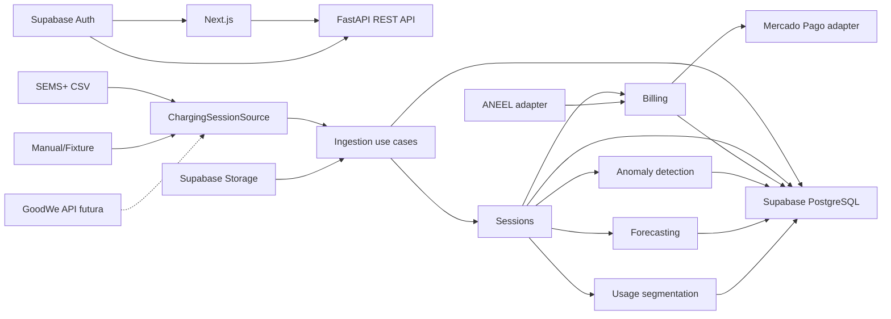

# EV ChargeOps - Technical Specification

**Status:** aprovado para implementação

**Data:** 29 de agosto de 2026

**PRD:** [../product/prd.md](../product/prd.md)

**Decisões:** [../decisions](../decisions)

## 1. Objetivo técnico

Construir uma aplicação web modular que transforme registros de recarga de fontes substituíveis em sessões canônicas, rateio, insights e cobranças auditáveis. A primeira fonte será arquivo CSV compatível com o histórico observado no SEMS+; APIs e protocolos futuros implementarão os mesmos contratos.

## 2. Stack

- **Frontend:** Next.js com App Router, React, TypeScript e Tailwind CSS.
- **Backend:** Python, FastAPI, Pydantic e REST.
- **Contrato:** OpenAPI gerado pelo backend e client TypeScript gerado ou validado no monorepo.
- **Persistência:** PostgreSQL gerenciado pelo Supabase, acessado pelo FastAPI com SQLAlchemy; migrations com Alembic.
- **Identidade:** Supabase Auth; JWT validado pelo FastAPI.
- **Arquivos:** Supabase Storage para originais de importação, com acesso pelo backend.
- **Workspace:** monorepo misto; pnpm para frontend/client e projeto Python isolado para a API.
- **Dados e IA:** pandas e scikit-learn, com modelos versionados e execução reproduzível.
- **Testes:** pytest no backend e Playwright nos fluxos críticos da aplicação.

## 3. Arquitetura de alto nível



O Next.js não acessa tabelas operacionais diretamente. O FastAPI concentra autorização, regras, auditoria, integrações e os módulos analíticos. Esses módulos compartilham o mesmo deploy inicialmente, mas dependem de ports próprios para permitir extração futura.

## 4. Estrutura do monorepo

```text
ev-chargeops/
├── apps/
│   ├── web/
│   │   ├── app/
│   │   ├── components/
│   │   └── lib/
│   └── api/
│       ├── app/
│       │   ├── modules/
│       │   └── shared/
│       ├── alembic/
│       ├── tests/
│       └── pyproject.toml
├── packages/
│   ├── api-client/
│   ├── eslint-config/
│   └── typescript-config/
├── docs/
└── data/exemplos/
```

## 5. Organização do backend

Cada módulo segue uma estrutura interna orientada ao domínio:

```text
modules/ingestion/
├── domain/
├── application/
├── infrastructure/
└── presentation/
```

- **domain:** entidades, value objects e regras puras.
- **application:** casos de uso e ports.
- **infrastructure:** SQLAlchemy, Supabase, adapters externos e implementações analíticas.
- **presentation:** routers FastAPI, schemas Pydantic e mapeamento HTTP.

Módulos iniciais: `identity`, `organizations`, `ingestion`, `sessions`, `tariffs`, `billing`, `payments`, `insights` e `audit`. Dentro de `insights`, `anomaly_detection`, `forecasting` e `segmentation` são capacidades separadas, não um engine genérico único.

## 6. Ports principais

```python
class ChargingSessionSource(Protocol):
    kind: SourceKind

    async def read(self, input: SessionSourceInput) -> list[SourceRecord]: ...

    def normalize(self, record: SourceRecord) -> SessionCandidate: ...


class TariffProvider(Protocol):
    async def get_applicable_tariff(self, query: TariffQuery) -> TariffSnapshot: ...


class PaymentGateway(Protocol):
    async def create_pix_order(self, request: PixOrderRequest) -> PaymentOrder: ...

    async def parse_webhook(self, input: WebhookInput) -> PaymentEvent: ...


class AnomalyDetector(Protocol):
    def detect(self, dataset: SessionDataset) -> list[AnomalyResult]: ...


class ConsumptionForecaster(Protocol):
    def forecast(self, dataset: SessionDataset, horizon: ForecastHorizon) -> Forecast: ...


class UsageSegmenter(Protocol):
    def segment(self, dataset: UserFeatureDataset) -> SegmentationResult: ...
```

Adapters iniciais: `SemsCsvSource`, `ManualSessionSource`, `AneelTariffProvider`, `MercadoPagoSandboxGateway`, `StatisticalAnomalyDetector`, `RegressionConsumptionForecaster` e `KMeansUsageSegmenter`.

Os ports recebem datasets canônicos, nunca DataFrames ou payloads específicos de fornecedor. pandas e scikit-learn permanecem detalhes de infraestrutura. Isso permite trocar algoritmo ou extrair a IA para outro processo sem alterar os casos de uso.

## 7. Modelo canônico de sessão

| Campo | Regra |
|---|---|
| `id` | UUID interno |
| `organizationId` | Obrigatório para isolamento |
| `siteId` | Local da infraestrutura |
| `chargerId` | Carregador interno resolvido pelo serial |
| `source` | Origem normalizada |
| `externalId` | Identificador externo quando existente |
| `deduplicationKey` | Hash de origem, carregador, início, fim e energia |
| `startedAt`, `endedAt` | UTC; fim posterior ao início |
| `energyKwh` | Decimal positivo |
| `averagePowerKw` | Derivado de energia e duração |
| `chargePort` | Opcional |
| `cardIdRaw` | Opcional e não confiável por padrão |
| `userId`, `unitId` | Opcionais até atribuição |
| `identityConfidence` | `confirmed`, `assigned` ou `unknown` |
| `importBatchId` | Lote que originou a sessão |
| `rawRecordId` | Registro bruto auditável |
| `status` | `pending_review`, `ready`, `flagged`, `billed` ou `discarded` |

O campo bruto rotulado como `Card ID` não será usado como identidade confirmada enquanto repetir o serial do carregador.

## 8. Entidades persistentes

- `Organization`, `Site`, `Charger`, `Unit`, `Profile`, `Membership`.
- `ImportBatch`, `RawImportRecord`, `ChargingSession`, `SessionAssignment`.
- `TariffSnapshot`, `BillingPolicy`, `BillingPeriod`.
- `Invoice`, `InvoiceItem`, `PaymentOrder`, `PaymentEvent`.
- `AnomalyFlag`, `ForecastSnapshot`, `UsageSegmentSnapshot`, `InsightRun`, `AuditEvent`.

Valores monetários usam centavos inteiros. Energia e potência usam `numeric` com precisão explícita. Instantes usam `timestamptz`.

## 9. Idempotência e estados

### Importação

- `ImportBatch.checksum` impede repetição acidental do mesmo arquivo.
- `ChargingSession.deduplicationKey` possui índice único por organização.
- Registros inválidos permanecem associados ao lote sem criar sessão.

### Faturamento

- Fechamento cria snapshot imutável da política e tarifa.
- Uma sessão faturada não muda de fatura por edição silenciosa.
- Correções produzem estorno ou nova versão auditada.

### Pagamento

- `PaymentEvent.providerEventId` é único.
- Transições inválidas são ignoradas e registradas.
- O webhook responde sucesso somente após persistência idempotente.

## 10. API REST inicial

```text
POST   /v1/import-batches/preview
POST   /v1/import-batches
GET    /v1/import-batches/:id
GET    /v1/sessions
GET    /v1/sessions/:id
POST   /v1/sessions/:id/assignments
GET    /v1/tariffs
POST   /v1/tariffs/sync
POST   /v1/billing-periods
POST   /v1/billing-periods/:id/close
GET    /v1/invoices
GET    /v1/invoices/:id
POST   /v1/invoices/:id/pix-orders
POST   /v1/webhooks/mercado-pago
GET    /v1/insights
POST   /v1/insight-runs/anomalies
POST   /v1/insight-runs/forecasts
POST   /v1/insight-runs/segments
GET    /v1/insight-runs/:id
GET    /v1/dashboard/manager
GET    /v1/dashboard/resident
```

Listagens aceitam paginação, período e escopo organizacional. Nenhum identificador recebido do cliente substitui o escopo derivado do token.

## 11. Autenticação e autorização

1. Next.js autentica pelo Supabase Auth.
2. Requisições à API levam JWT no header `Authorization`.
3. FastAPI valida assinatura, expiração e claims.
4. Uma dependência de autorização resolve `profile`, `membership`, `organizationId` e papel.
5. Casos de uso recebem o escopo já validado.
6. Repositórios aplicam `organizationId` em todas as consultas operacionais.

Supabase RLS protege qualquer superfície exposta pelo próprio Supabase. A aplicação não entrega `service_role` ao navegador.

## 12. Procedência e auditoria

Cada sessão mantém o registro bruto e a fonte. Atribuição, descarte, fechamento, emissão e transição de pagamento geram `AuditEvent` com ator, instante, organização, entidade e metadados sanitizados.

A interface diferencia:

- `real`: horário e energia obtidos do SEMS+.
- `assigned`: usuário ou unidade associados para a demonstração.
- `simulated`: dado criado para cobrir cenário sem observação real.
- `derived`: valor calculado a partir de outros campos.
- `external`: tarifa ou estado obtido de serviço terceiro.

## 13. Erros

A API usa envelope estável:

```json
{
  "error": {
    "code": "SESSION_DUPLICATE",
    "message": "A sessão já foi importada.",
    "correlationId": "uuid",
    "details": []
  }
}
```

Categorias: validação (400/422), autenticação (401), autorização (403), conflito/idempotência (409), dependência externa (502/503) e falha interna (500). Mensagens ao cliente não incluem segredos ou payloads sensíveis.

Falhas de ANEEL ou Mercado Pago não corrompem o estado local. A operação permanece pendente, registra tentativa e permite retry seguro.

## 14. Insights e IA

Os três módulos analíticos fazem parte do incremento demonstrável:

### 14.1 Detecção de anomalias

Combina validações determinísticas com análise estatística da relação entre energia, duração e potência. Deve identificar pelo menos horários inválidos, energia não positiva, potência média incompatível com o equipamento e outliers em relação ao histórico disponível.

Cada flag inclui regra ou algoritmo, severidade, evidência, explicação e confiança. Sessões críticas precisam de decisão registrada antes do faturamento.

### 14.2 Previsão de consumo e demanda

Produz uma estimativa por período e, quando a granularidade permitir, uma projeção de pico agregado. O primeiro modelo poderá usar regressão ou série temporal simples, mas sempre informará horizonte, tamanho da amostra, erro de validação e intervalo ou faixa de incerteza. Dados insuficientes geram um resultado explicitamente inconclusivo, não uma previsão artificialmente precisa.

### 14.3 Segmentação de perfis

Extrai atributos como frequência, energia média, duração e horário predominante por usuário e aplica clustering. Como a telemetria real observada não contém identidade confiável, a demonstração poderá combinar sessões reais com atribuições simuladas ou usar o conjunto da Sprint 01, desde que a procedência seja apresentada. Os nomes dos segmentos são interpretações posteriores; o algoritmo não os trata como fatos de origem.

### 14.4 Reprodutibilidade

Cada `InsightRun` registra tipo, versão do algoritmo, parâmetros, seed quando aplicável, checksum ou snapshot do dataset, instante, métricas de avaliação e procedência. Os módulos não acessam diretamente o banco: casos de uso constroem datasets canônicos e persistem os resultados retornados.

Uma interface conversacional poderá narrar resultados persistidos, mas não substitui os três módulos nem recalcula valores financeiros.

## 15. Observabilidade

- Logs JSON com `correlationId`, módulo, organização, operação e resultado.
- Métricas de lote, duração, rejeição, duplicação, execuções de insights e dependências externas.
- Audit log separado de logs técnicos.
- Payloads brutos, tokens, e-mails e informações de pagamento não entram em logs.

## 16. Estratégia de testes

- **Unitários:** entidades, deduplicação, rateio, estados e anomalias.
- **Contrato de adapter:** toda fonte deve produzir os mesmos `SessionCandidate` para fixtures equivalentes.
- **IA:** datasets fixos e seeds controladas validam anomalias, previsão e clustering de forma reproduzível.
- **Integração:** SQLAlchemy/PostgreSQL, autenticação, isolamento e endpoints.
- **Consumer contract:** respostas sanitizadas dos sandboxes de ANEEL e Mercado Pago.
- **E2E:** importar, atribuir, fechar, emitir, criar Pix e visualizar como morador.
- **Segurança:** acesso cruzado, arquivos inválidos, replay de webhook e ausência de segredos.

## 17. Deployment

- Frontend e backend são artefatos independentes do mesmo monorepo.
- Supabase fornece Postgres, Auth e Storage.
- Migrations Alembic são executadas em etapa controlada do deploy.
- Ambientes `local`, `preview` e `demo` usam projetos ou schemas isolados.
- Apenas credenciais sandbox são permitidas no ambiente de demonstração.

## 18. Caminho de evolução

1. CSV SEMS+ e dados demonstrativos.
2. Adapter oficial GoodWe quando houver credenciais e cobertura de EV Charger.
3. Ingestão assíncrona e fila quando volume ou latência exigirem.
4. Evolução dos modelos quando houver histórico suficiente e ganho mensurável.
5. Extração da IA para serviço independente somente quando escala, ownership, runtime ou deployment justificarem.

O domínio de sessões, rateio e auditoria permanece estável em todas as etapas.
