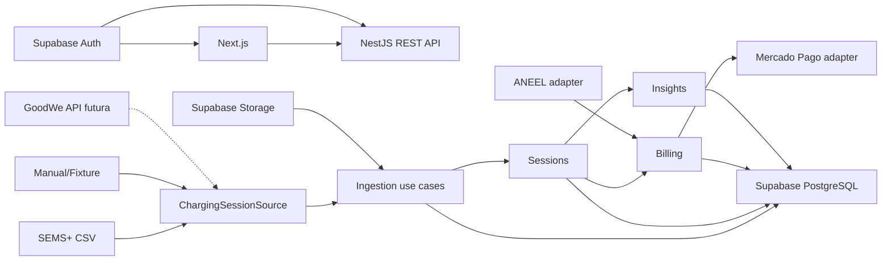

# EV ChargeOps - Technical Specification

**Status:** proposta consolidada para revisão

**Data:** 29 de agosto de 2026

**PRD:** [../product/prd.md](../product/prd.md)

**Decisões:** [../decisions](../decisions)

## 1. Objetivo técnico

Construir uma aplicação web modular que transforme registros de recarga de fontes substituíveis em sessões canônicas, rateio, insights e cobranças auditáveis. A primeira fonte será arquivo CSV compatível com o histórico observado no SEMS+; APIs e protocolos futuros implementarão os mesmos contratos.

## 2. Stack

- **Frontend:** Next.js com App Router, React, TypeScript e Tailwind CSS.
- **Backend:** NestJS sobre o adaptador HTTP padrão, TypeScript e REST.
- **Contrato:** OpenAPI gerado pelo backend e tipos compartilhados no monorepo.
- **Persistência:** PostgreSQL gerenciado pelo Supabase, acessado pelo NestJS com Prisma.
- **Identidade:** Supabase Auth; JWT validado pelo NestJS.
- **Arquivos:** Supabase Storage para originais de importação, com acesso pelo backend.
- **Workspace:** monorepo com pnpm workspaces.
- **Testes:** testes unitários e de integração no backend; Playwright para fluxos críticos.

## 3. Arquitetura de alto nível



O Next.js não acessa tabelas operacionais diretamente. O NestJS concentra autorização, regras, auditoria e integrações.

## 4. Estrutura do monorepo

```text
ev-chargeops/
├── apps/
│   ├── web/
│   │   ├── app/
│   │   ├── components/
│   │   └── lib/
│   └── api/
│       ├── src/modules/
│       └── test/
├── packages/
│   ├── contracts/
│   ├── eslint-config/
│   └── typescript-config/
├── prisma/
│   ├── schema.prisma
│   └── migrations/
├── docs/
└── data/exemplos/
```

## 5. Organização do backend

Cada módulo segue uma estrutura interna orientada ao domínio:

```text
modules/ingestion/
├── domain/
├── application/
├── infrastructure/
└── presentation/
```

- **domain:** entidades, value objects e regras puras.
- **application:** casos de uso e ports.
- **infrastructure:** Prisma, Supabase e adapters externos.
- **presentation:** controllers, DTOs e mapeamento HTTP.

Módulos iniciais: `identity`, `organizations`, `ingestion`, `sessions`, `tariffs`, `billing`, `payments`, `insights` e `audit`.

## 6. Ports principais

```ts
type SourceKind = 'sems_csv' | 'manual' | 'simulated' | 'goodwe_api';

type SessionSourceInput =
  | { mode: 'file'; filename: string; content: Uint8Array }
  | { mode: 'window'; from: Date; to: Date; cursor?: string };

interface SourceRecord {
  externalId?: string;
  raw: Record<string, unknown>;
}

interface SessionCandidate {
  source: SourceKind;
  externalId?: string;
  chargerSerial: string;
  startedAt: Date;
  endedAt: Date;
  energyKwh: string;
  chargePort?: number;
  cardIdRaw?: string;
  raw: Record<string, unknown>;
}

interface ChargingSessionSource {
  readonly kind: SourceKind;
  read(input: SessionSourceInput): Promise<SourceRecord[]>;
  normalize(record: SourceRecord): SessionCandidate;
}

interface TariffProvider {
  getApplicableTariff(input: TariffQuery): Promise<TariffSnapshot>;
}

interface PaymentGateway {
  createPixOrder(input: PixOrderRequest): Promise<PaymentOrder>;
  parseWebhook(input: WebhookInput): Promise<PaymentEvent>;
}

interface InsightEngine {
  analyzeSession(input: SessionAnalysisInput): Promise<Insight[]>;
  forecastPeriod(input: ForecastInput): Promise<Forecast>;
}
```

Adapters iniciais: `SemsCsvSource`, `ManualSessionSource`, `AneelTariffProvider`, `MercadoPagoSandboxGateway` e `StatisticalInsightEngine`.

## 7. Modelo canônico de sessão

| Campo | Regra |
|---|---|
| `id` | UUID interno |
| `organizationId` | Obrigatório para isolamento |
| `siteId` | Local da infraestrutura |
| `chargerId` | Carregador interno resolvido pelo serial |
| `source` | Origem normalizada |
| `externalId` | Identificador externo quando existente |
| `deduplicationKey` | Hash de origem, carregador, início, fim e energia |
| `startedAt`, `endedAt` | UTC; fim posterior ao início |
| `energyKwh` | Decimal positivo |
| `averagePowerKw` | Derivado de energia e duração |
| `chargePort` | Opcional |
| `cardIdRaw` | Opcional e não confiável por padrão |
| `userId`, `unitId` | Opcionais até atribuição |
| `identityConfidence` | `confirmed`, `assigned` ou `unknown` |
| `importBatchId` | Lote que originou a sessão |
| `rawRecordId` | Registro bruto auditável |
| `status` | `pending_review`, `ready`, `flagged`, `billed` ou `discarded` |

O campo bruto rotulado como `Card ID` não será usado como identidade confirmada enquanto repetir o serial do carregador.

## 8. Entidades persistentes

- `Organization`, `Site`, `Charger`, `Unit`, `Profile`, `Membership`.
- `ImportBatch`, `RawImportRecord`, `ChargingSession`, `SessionAssignment`.
- `TariffSnapshot`, `BillingPolicy`, `BillingPeriod`.
- `Invoice`, `InvoiceItem`, `PaymentOrder`, `PaymentEvent`.
- `AnomalyFlag`, `ForecastSnapshot`, `AuditEvent`.

Valores monetários usam centavos inteiros. Energia e potência usam `numeric` com precisão explícita. Instantes usam `timestamptz`.

## 9. Idempotência e estados

### Importação

- `ImportBatch.checksum` impede repetição acidental do mesmo arquivo.
- `ChargingSession.deduplicationKey` possui índice único por organização.
- Registros inválidos permanecem associados ao lote sem criar sessão.

### Faturamento

- Fechamento cria snapshot imutável da política e tarifa.
- Uma sessão faturada não muda de fatura por edição silenciosa.
- Correções produzem estorno ou nova versão auditada.

### Pagamento

- `PaymentEvent.providerEventId` é único.
- Transições inválidas são ignoradas e registradas.
- O webhook responde sucesso somente após persistência idempotente.

## 10. API REST inicial

```text
POST   /v1/import-batches/preview
POST   /v1/import-batches
GET    /v1/import-batches/:id
GET    /v1/sessions
GET    /v1/sessions/:id
POST   /v1/sessions/:id/assignments
GET    /v1/tariffs
POST   /v1/tariffs/sync
POST   /v1/billing-periods
POST   /v1/billing-periods/:id/close
GET    /v1/invoices
GET    /v1/invoices/:id
POST   /v1/invoices/:id/pix-orders
POST   /v1/webhooks/mercado-pago
GET    /v1/insights
GET    /v1/dashboard/manager
GET    /v1/dashboard/resident
```

Listagens aceitam paginação, período e escopo organizacional. Nenhum identificador recebido do cliente substitui o escopo derivado do token.

## 11. Autenticação e autorização

1. Next.js autentica pelo Supabase Auth.
2. Requisições à API levam JWT no header `Authorization`.
3. NestJS valida assinatura, expiração e claims.
4. Um guard resolve `profile`, `membership`, `organizationId` e papel.
5. Casos de uso recebem o escopo já validado.
6. Repositórios aplicam `organizationId` em todas as consultas operacionais.

Supabase RLS protege qualquer superfície exposta pelo próprio Supabase. A aplicação não entrega `service_role` ao navegador.

## 12. Procedência e auditoria

Cada sessão mantém o registro bruto e a fonte. Atribuição, descarte, fechamento, emissão e transição de pagamento geram `AuditEvent` com ator, instante, organização, entidade e metadados sanitizados.

A interface diferencia:

- `real`: horário e energia obtidos do SEMS+.
- `assigned`: usuário ou unidade associados para a demonstração.
- `simulated`: dado criado para cobrir cenário sem observação real.
- `derived`: valor calculado a partir de outros campos.
- `external`: tarifa ou estado obtido de serviço terceiro.

## 13. Erros

A API usa envelope estável:

```json
{
  "error": {
    "code": "SESSION_DUPLICATE",
    "message": "A sessão já foi importada.",
    "correlationId": "uuid",
    "details": []
  }
}
```

Categorias: validação (400/422), autenticação (401), autorização (403), conflito/idempotência (409), dependência externa (502/503) e falha interna (500). Mensagens ao cliente não incluem segredos ou payloads sensíveis.

Falhas de ANEEL ou Mercado Pago não corrompem o estado local. A operação permanece pendente, registra tentativa e permite retry seguro.

## 14. Insights

O primeiro `StatisticalInsightEngine` executa regras determinísticas e estatísticas simples:

- `endedAt <= startedAt`.
- energia não positiva.
- potência média acima da potência nominal com tolerância documentada.
- desvio elevado em relação à mediana histórica disponível.
- projeção linear baseada em consumo acumulado e dias observados.

Cada resultado inclui regra, entradas, explicação e confiança. Um futuro serviço Python implementará `InsightEngine` sem alterar os casos de uso.

## 15. Observabilidade

- Logs JSON com `correlationId`, módulo, organização, operação e resultado.
- Métricas de lote, duração, rejeição, duplicação e dependências externas.
- Audit log separado de logs técnicos.
- Payloads brutos, tokens, e-mails e informações de pagamento não entram em logs.

## 16. Estratégia de testes

- **Unitários:** entidades, deduplicação, rateio, estados e anomalias.
- **Contrato de adapter:** toda fonte deve produzir os mesmos `SessionCandidate` para fixtures equivalentes.
- **Integração:** Prisma/PostgreSQL, autenticação, isolamento e endpoints.
- **Consumer contract:** respostas sanitizadas dos sandboxes de ANEEL e Mercado Pago.
- **E2E:** importar, atribuir, fechar, emitir, criar Pix e visualizar como morador.
- **Segurança:** acesso cruzado, arquivos inválidos, replay de webhook e ausência de segredos.

## 17. Deployment

- Frontend e backend são artefatos independentes do mesmo monorepo.
- Supabase fornece Postgres, Auth e Storage.
- Migrations Prisma são executadas em etapa controlada do deploy.
- Ambientes `local`, `preview` e `demo` usam projetos ou schemas isolados.
- Apenas credenciais sandbox são permitidas no ambiente de demonstração.

## 18. Caminho de evolução

1. CSV SEMS+ e dados demonstrativos.
2. Adapter oficial GoodWe quando houver credenciais e cobertura de EV Charger.
3. Ingestão assíncrona e fila quando volume ou latência exigirem.
4. Serviço Python de ML quando houver histórico suficiente e ganho mensurável.
5. Separação de módulos em serviços somente quando escala, ownership ou deployment independente justificarem.

O domínio de sessões, rateio e auditoria permanece estável em todas as etapas.
