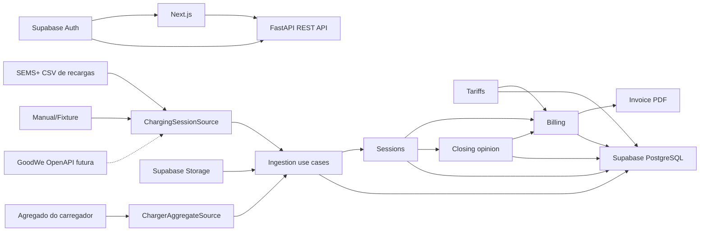

# EV ChargeOps - Technical Specification

**Versão:** 0.2

**Status:** aprovado para implementação

**Data:** 30 de agosto de 2026

**PRD:** [../product/prd.md](../product/prd.md)

**Decisões:** [../decisions](../decisions)

## 0. O que mudou na versão 0.2

Alinhamento ao recorte invoice-first do [PRD 0.4](../product/prd.md). As mudanças técnicas são:

- O módulo `payments` e o port `PaymentGateway` saem do incremento.
- Entram os módulos `tariffs` e `billing`, e o módulo `insights` passa a entregar apenas o
  parecer de fechamento neste incremento.
- Entra uma segunda fonte de ingestão para o agregado de energia do carregador, que não produz
  recargas faturáveis.
- Entra a renderização de PDF como port.
- Entra o contexto de morador (impersonate) no modelo de autorização.
- A Seção 7 passa a documentar o contrato de derivação de recargas a partir da OpenAPI da
  GoodWe, que a leitura da documentação oficial tornou possível especificar.

## 1. Objetivo técnico

Construir uma aplicação web modular que transforme registros de recarga de fontes
substituíveis em recargas canônicas, rateio versionado e faturas auditáveis. A primeira fonte
é arquivo CSV compatível com o histórico observado no SEMS+; APIs e protocolos futuros
implementam os mesmos contratos.

## 2. Stack

- **Frontend:** Next.js com App Router, React, TypeScript e Tailwind CSS.
- **Backend:** Python, FastAPI, Pydantic e REST.
- **Contrato:** OpenAPI gerado pelo backend e client TypeScript gerado ou validado no monorepo.
- **Persistência:** PostgreSQL gerenciado pelo Supabase, acessado pelo FastAPI com SQLAlchemy;
  migrations com Alembic.
- **Identidade:** Supabase Auth; JWT validado pelo FastAPI.
- **Arquivos:** Supabase Storage para originais de importação, com acesso pelo backend.
- **Workspace:** monorepo misto; pnpm para frontend/client e projeto Python isolado para a API.
- **Dados e IA:** pandas e scikit-learn, com execução reproduzível e versionada.
- **Testes:** pytest no backend e Playwright nos fluxos críticos da aplicação.

## 3. Arquitetura de alto nível



O Next.js não acessa tabelas operacionais diretamente. O FastAPI concentra autorização, regras,
auditoria, integrações e os módulos analíticos.

O dashboard não reconstrói recargas a partir de registros brutos de importação. Ele consulta o
read model canônico; assim, atribuições auditadas aparecem imediatamente nos totais por unidade
e nenhum `Card ID` ou serial de carregador é promovido a identidade de cobrança.

O agregado do carregador entra por um port próprio e desemboca em uma tabela própria. Ele nunca
alimenta `ChargingSession`.

## 4. Estrutura do monorepo

```text
ev-chargeops/
├── apps/
│   ├── web/
│   │   ├── app/
│   │   ├── components/
│   │   └── lib/
│   └── api/
│       ├── app/
│       │   ├── modules/
│       │   └── shared/
│       ├── alembic/
│       ├── tests/
│       └── pyproject.toml
├── packages/
│   ├── api-client/
│   ├── eslint-config/
│   └── typescript-config/
├── docs/
└── data/
    ├── exemplos/     ← conjunto fabricado da Sprint 1
    └── sems-plus/    ← capturas reais do fornecedor
```

## 5. Organização do backend

Cada módulo segue uma estrutura interna orientada ao domínio:

```text
modules/billing/
├── domain/
├── application/
├── infrastructure/
└── presentation/
```

- **domain:** entidades, value objects e regras puras.
- **application:** casos de uso e ports.
- **infrastructure:** SQLAlchemy, Supabase, adapters externos e implementações analíticas.
- **presentation:** routers FastAPI, schemas Pydantic e mapeamento HTTP.

Módulos deste incremento: `identity`, `organizations`, `ingestion`, `sessions`, `tariffs`,
`billing`, `insights` e `audit`.

Dentro de `insights`, apenas `closing_opinion` é implementado agora. `forecasting` e
`segmentation` permanecem no plano com seus contratos definidos, sem implementação.

O módulo `payments` sai do incremento. Seu contrato permanece registrado na Seção 6 como
extensão futura.

## 6. Ports principais

```python
class ChargingSessionSource(Protocol):
    kind: SourceKind

    async def read(self, input: SessionSourceInput) -> list[SourceRecord]: ...

    def normalize(self, record: SourceRecord) -> SessionCandidate: ...


class ChargerAggregateSource(Protocol):
    """Energia agregada informada pelo equipamento. Nunca produz SessionCandidate."""

    kind: SourceKind

    async def read(self, input: AggregateSourceInput) -> list[AggregateRecord]: ...

    def normalize(self, record: AggregateRecord) -> ChargerEnergyReading: ...


class TariffProvider(Protocol):
    async def get_applicable_tariff(self, query: TariffQuery) -> TariffSnapshot: ...


class ClosingOpinionAnalyzer(Protocol):
    def analyze(self, dataset: PeriodDataset) -> ClosingOpinion: ...


class InvoiceRenderer(Protocol):
    def render_pdf(self, invoice: IssuedInvoice) -> RenderedDocument: ...
```

Adapters deste incremento: `SemsCsvSource`, `ManualSessionSource`, `SemsAggregateCsvSource`,
`VersionedTariffProvider`, `RuleBasedClosingOpinionAnalyzer` e `PdfInvoiceRenderer`.

Contratos preservados para P1, sem implementação: `ConsumptionForecaster`, `UsageSegmenter` e
`PaymentGateway`.

Os ports recebem datasets canônicos, nunca DataFrames ou payloads específicos de fornecedor.
pandas e scikit-learn permanecem detalhes de infraestrutura.

## 7. Fontes de dados do fornecedor

### 7.1 Situação atual

A API de EV Chargers não é disponibilizada aos grupos do desafio. A ingestão de recargas ocorre
por importação estruturada de arquivo, com procedência registrada por lote.

### 7.2 O que a OpenAPI da GoodWe expõe

A documentação oficial (`openapi.goodwe.com`) define `deviceType = 5` como EV Charger e não
oferece nenhum endpoint de histórico de sessões. A superfície disponível é consulta de estação,
lista de dispositivos, atributos, telemetria em tempo real e histórica, estatísticas, alarmes e
despacho remoto.

Os atributos do EV Charger são apenas `model` e `ratedPower`. A única estatística é
`evChargercharge`, energia agregada em kWh.

**Não existe campo de identidade em nenhum ponto da especificação.** Não há cartão, RFID,
usuário ou proprietário. Essa é a lacuna estrutural que o EV ChargeOps preenche: a atribuição
de consumo a uma unidade não pode ser derivada do fornecedor e exige decisão humana auditável.

### 7.3 Contrato de derivação de recargas

A telemetria do EV Charger suporta consulta histórica e contém os campos necessários para
derivar recargas de forma determinística:

| Campo | Uso na derivação |
|---|---|
| `vehConnectStatus` | Máquina de estados: `0` desconectado, `1` conectado sem carregar, `2` carregando |
| `currentChargeE` | Energia da sessão corrente, em kWh |
| `currentChargeTime` | Duração da sessão corrente, em segundos |
| `activePower` | Potência instantânea de carga, em kW |
| `evChargerCharge` | Energia acumulada do equipamento |
| `refreshTime` | Instante da amostra, UTC em milissegundos |

Regra: uma recarga inicia na transição para `vehConnectStatus = 2` e encerra ao sair desse
estado. No encerramento, `currentChargeE` fixa a energia e `currentChargeTime` fixa a duração.
`activePower` fornece a curva interna da recarga.

Quando houver credenciais, o adapter `GoodWeApiSource` implementa `ChargingSessionSource`
aplicando esta regra, sem alterar o domínio. O CSV é o adapter de hoje por ausência de
credencial, não por ausência do dado.

## 8. Modelo canônico de recarga

| Campo | Regra |
|---|---|
| `id` | UUID interno |
| `organizationId` | Obrigatório para isolamento |
| `siteId` | Local da infraestrutura |
| `chargerId` | Carregador interno resolvido pelo serial |
| `source` | Origem normalizada |
| `externalId` | Identificador externo quando existente |
| `deduplicationKey` | Hash de origem, carregador, início, fim e energia |
| `startedAt`, `endedAt` | UTC; fim posterior ao início |
| `energyKwh` | Decimal positivo |
| `averagePowerKw` | Derivado de energia e duração |
| `chargePort` | Opcional |
| `cardIdRaw` | Opcional e não confiável por padrão |
| `unitId` | Opcional até atribuição |
| `identityConfidence` | `confirmed`, `assigned` ou `unknown` |
| `importBatchId` | Lote que originou a recarga |
| `rawRecordId` | Registro bruto auditável |
| `status` | `pending_review`, `ready`, `flagged`, `billed` ou `discarded` |

O campo bruto rotulado como `Card ID` não é usado como identidade confirmada enquanto repetir o
serial do carregador.

## 9. Entidades persistentes

- `Organization`, `Site`, `Charger`, `Unit`, `Profile`, `Membership`.
- `ImportBatch`, `RawImportRecord`, `ChargingSession`, `SessionAssignment`.
- `ChargerEnergyReading` — agregado do equipamento por período, com procedência. Não faturável.
- `TariffSnapshot`, `BillingPolicy`, `BillingPeriod`.
- `Invoice`, `InvoiceItem`, `InvoiceDocument`.
- `AnomalyFlag`, `ClosingOpinion`, `InsightRun`, `AuditEvent`.

Valores monetários usam centavos inteiros. Energia e potência usam `numeric` com precisão
explícita. Instantes usam `timestamptz`.

`BillingPeriod` registra estado (`open`, `closing`, `closed`), ator e instante da aprovação, e o
snapshot imutável de tarifa e política aplicado no fechamento.

`Invoice` referencia o snapshot, não a tarifa vigente. Uma tarifa alterada depois não altera
nenhuma fatura emitida.

## 10. Idempotência e estados

### Importação

- `ImportBatch.checksum` impede repetição acidental do mesmo arquivo.
- `ChargingSession.deduplicationKey` possui índice único por organização.
- Registros inválidos permanecem associados ao lote sem criar recarga.
- O agregado usa chave única por organização, carregador, tipo de período e valor do período.

### Fechamento

- O fechamento é transacional: cria snapshot, emite faturas e marca recargas como `billed` em
  uma única operação.
- Reexecutar o fechamento de um período já fechado é rejeitado com conflito.
- Uma recarga faturada não muda de fatura por edição silenciosa.
- Correções produzem estorno ou nova versão auditada, fora do escopo deste incremento.

### Cálculo

- O rateio é uma função pura de `(recargas elegíveis, snapshot de tarifa, política)`.
- A mesma entrada produz sempre a mesma saída, em centavos inteiros.
- O arredondamento é definido uma única vez no domínio.

## 11. API REST

```text
POST   /v1/import-batches/preview
POST   /v1/import-batches
GET    /v1/import-batches/:id
POST   /v1/charger-readings/import
GET    /v1/charger-readings
GET    /v1/sessions
GET    /v1/sessions/:id
PUT    /v1/sessions/:id/assignment
GET    /v1/assignment-units
GET    /v1/tariffs
POST   /v1/tariffs
GET    /v1/billing-periods
POST   /v1/billing-periods
GET    /v1/billing-periods/:id
GET    /v1/billing-periods/:id/readiness
POST   /v1/billing-periods/:id/close
GET    /v1/invoices
GET    /v1/invoices/:id
GET    /v1/invoices/:id/document
POST   /v1/insight-runs/closing-opinion
GET    /v1/insight-runs/:id
GET    /v1/dashboard/manager
POST   /v1/resident-context
DELETE /v1/resident-context
```

Listagens aceitam paginação, período e escopo organizacional. Nenhum identificador recebido do
cliente substitui o escopo derivado do token.

`GET /v1/billing-periods/:id/readiness` retorna cobertura de atribuição, pendências
bloqueantes, reconciliação interna e reconciliação contra o agregado do carregador.

## 12. Autenticação e autorização

1. Next.js autentica pelo Supabase Auth.
2. Requisições à API levam JWT no header `Authorization`.
3. FastAPI valida assinatura, expiração e claims.
4. Uma dependência de autorização resolve `profile`, `membership`, `organizationId` e papel.
5. Casos de uso recebem o escopo já validado.
6. Repositórios aplicam `organizationId` em todas as consultas operacionais.

### Contexto de morador

`POST /v1/resident-context` permite ao gestor assumir um contexto restrito a uma unidade.

- O contexto resultante carrega papel `resident` e `unitId`, e é resolvido pela **mesma**
  dependência de autorização usada por um morador real.
- Repositórios aplicam o filtro de unidade além do filtro de organização.
- Toda escrita é rejeitada enquanto o contexto estiver ativo.
- A entrada no contexto gera `AuditEvent` com ator, unidade e instante.
- O contexto tem validade curta e é encerrado explicitamente.

Essa é a única porta de acesso do papel `resident` neste incremento. Criar um login próprio de
morador depois não altera nada além de acrescentar outra forma de obter o mesmo contexto.

Supabase RLS protege qualquer superfície exposta pelo próprio Supabase. A aplicação não entrega
`service_role` ao navegador.

## 13. Procedência e auditoria

Cada recarga mantém o registro bruto e a fonte. Atribuição, descarte, fechamento, emissão e
entrada em contexto de morador geram `AuditEvent` com ator, instante, organização, entidade e
metadados sanitizados.

A interface diferencia:

- `real`: horário e energia obtidos do SEMS+.
- `assigned`: unidade associada por decisão humana registrada.
- `simulated`: dado criado para cobrir cenário sem observação real.
- `derived`: valor calculado a partir de outros campos.
- `external`: tarifa ou estado obtido de serviço terceiro.

Dados reais e demonstrativos nunca são somados sem que a interface exiba a composição.

## 14. Erros

A API usa envelope estável:

```json
{
  "error": {
    "code": "SESSION_DUPLICATE",
    "message": "A recarga já foi importada.",
    "correlationId": "uuid",
    "details": []
  }
}
```

Categorias: validação (400/422), autenticação (401), autorização (403), conflito/idempotência
(409), dependência externa (502/503) e falha interna (500). Mensagens ao cliente não incluem
segredos ou payloads sensíveis.

Fechar um período com bloqueios não resolvidos retorna `409` com a lista de bloqueios.

## 15. Tarifa, rateio e fechamento

### Tarifa versionada

`TariffSnapshot` guarda faixas horárias com valor em centavos por kWh, vigência, fonte e data de
captura. Uma faixa é resolvida para cada recarga a partir do horário observado.

### Política de rateio

`BillingPolicy` guarda a taxa de infraestrutura por unidade ativa e o percentual de perdas, com
versão própria.

### Cálculo

```text
fatura(unidade, período) = energia_individual + taxa_infra + rateio_perdas
```

Implementado como função pura sobre inteiros em centavos, com arredondamento único definido no
domínio. Validado contra o exemplo resolvido da Sprint 1 em `data/exemplos/faturas.csv`.

### Reconciliação

O fechamento calcula e exibe duas diferenças:

- **Interna:** energia elegível menos energia faturada. Esperada em `0,00 kWh`.
- **Externa:** energia faturada menos o agregado do carregador no período. Quando diferente de
  zero, é apresentada como alerta com o valor, nunca absorvida na fatura.

## 16. Parecer de fechamento

Combina validações determinísticas com análise estatística da relação entre energia, duração e
potência derivada, comparada à potência nominal do equipamento.

Identifica no mínimo horários inválidos, energia não positiva, potência média incompatível,
duplicidades e outliers frente ao histórico disponível.

Cada achado inclui regra ou algoritmo, severidade, evidência, explicação e confiança. O parecer
consolidado apresenta conclusão, severidade, confiança, evidências e recomendação. Achados
críticos bloqueiam o fechamento até decisão registrada.

Amostra insuficiente produz resultado explicitamente inconclusivo.

Cada `InsightRun` registra tipo, versão do algoritmo, parâmetros, seed quando aplicável,
checksum do dataset, instante, métricas e procedência. Os módulos não acessam o banco
diretamente: casos de uso constroem datasets canônicos e persistem os resultados retornados.

O parecer atua **antes** da fatura. Ele não recalcula valores financeiros.

## 17. Observabilidade

- Logs JSON com `correlationId`, módulo, organização, operação e resultado.
- Métricas de lote, duração, rejeição, duplicação, execuções de insights e fechamentos.
- Audit log separado de logs técnicos.
- Payloads brutos, tokens e e-mails não entram em logs.

## 18. Estratégia de testes

- **Unitários:** entidades, deduplicação, rateio, estados, arredondamento e regras de anomalia.
- **Golden:** o motor de rateio reproduz as seis faturas de `data/exemplos/faturas.csv` ao
  centavo, incluindo recarga interrompida, unidade sem consumo e duas faturas na mesma unidade.
- **Contrato de adapter:** toda fonte produz os mesmos `SessionCandidate` para fixtures
  equivalentes.
- **Reconciliação:** fechamento sobre fixture conhecido fecha em `0,00 kWh` interno e reporta a
  diferença externa esperada.
- **Imutabilidade:** alterar tarifa após emissão não altera nenhuma fatura emitida.
- **Integração:** SQLAlchemy/PostgreSQL, autenticação, isolamento e endpoints.
- **Autorização:** acesso cruzado entre organizações, e contexto de morador que não alcança
  outra unidade nem executa escrita.
- **E2E:** importar, atribuir, revisar parecer, aprovar fechamento, emitir fatura, baixar PDF e
  visualizar como morador.
- **Segurança:** arquivos inválidos e ausência de segredos.

## 19. Deployment

- Frontend e backend são artefatos independentes do mesmo monorepo.
- Supabase fornece Postgres, Auth e Storage.
- Migrations Alembic são executadas em etapa controlada do deploy.
- Ambientes `local`, `preview` e `demo` usam projetos ou schemas isolados.

## 20. Caminho de evolução

1. CSV SEMS+ e cenário demonstrativo rotulado.
2. Adapter `GoodWeApiSource` quando houver credenciais, aplicando a regra da Seção 7.3.
3. Previsão e segmentação, sobre histórico acumulado.
4. Pagamento, quando houver decisão de cobrança fora da taxa condominial.
5. Correção e reabertura formal de períodos fechados.
6. Extração da IA para serviço independente somente quando escala, ownership, runtime ou
   deployment justificarem.

O domínio de recargas, rateio e auditoria permanece estável em todas as etapas.
